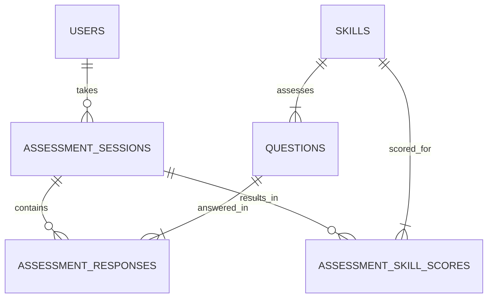

# Database Schema: Learner Insights (MVP - Grade 5 Math)

This document outlines the initial database schema for the MVP focusing on Grade 5 Mathematics.

## Tables

### 1. `users`

Stores information about registered users (primarily students for MVP).

| Column Name    | Data Type        | Constraints              | Description                                      |
|----------------|------------------|--------------------------|--------------------------------------------------|
| `id`           | UUID             | PRIMARY KEY, DEFAULT gen_random_uuid() | Unique identifier for the user                   |
| `email`        | VARCHAR(255)     | UNIQUE, NOT NULL         | User's email address (for login)                 |
| `password_hash`| VARCHAR(255)     | NOT NULL                 | Hashed password for authentication             |
| `first_name`   | VARCHAR(100)     | NULL                     | User's first name                                |
| `last_name`    | VARCHAR(100)     | NULL                     | User's last name                                 |
| `grade_level`  | INTEGER          | NOT NULL                 | Student's current grade level (e.g., 5)          |
| `role`         | VARCHAR(50)      | NOT NULL, DEFAULT 'student' | User role (e.g., 'student', 'parent', 'teacher') |
| `created_at`   | TIMESTAMPTZ      | NOT NULL, DEFAULT NOW()  | Timestamp of user creation                     |
| `updated_at`   | TIMESTAMPTZ      | NOT NULL, DEFAULT NOW()  | Timestamp of last user update                  |

**Indexes:**
*   Index on `email`
*   Index on `role`

### 2. `skills`

Defines the specific academic and cognitive skills being assessed.

| Column Name    | Data Type        | Constraints              | Description                                         |
|----------------|------------------|--------------------------|-----------------------------------------------------|
| `id`           | UUID             | PRIMARY KEY, DEFAULT gen_random_uuid() | Unique identifier for the skill                     |
| `name`         | VARCHAR(255)     | NOT NULL                 | Name of the skill (e.g., "Fraction Addition")       |
| `subject`      | VARCHAR(100)     | NOT NULL                 | Subject area (e.g., "Mathematics", "Cognitive") |
| `category`     | VARCHAR(100)     | NULL                     | Sub-category (e.g., "Number Operations", "Reasoning") |
| `description`  | TEXT             | NULL                     | Optional description of the skill                   |
| `created_at`   | TIMESTAMPTZ      | NOT NULL, DEFAULT NOW()  | Timestamp of skill creation                       |

**Indexes:**
*   Index on `name`
*   Index on `subject`

### 3. `questions`

Stores the individual assessment questions.

| Column Name        | Data Type        | Constraints                           | Description                                                       |
|--------------------|------------------|---------------------------------------|-------------------------------------------------------------------|
| `id`               | UUID             | PRIMARY KEY, DEFAULT gen_random_uuid() | Unique identifier for the question                                |
| `question_text`    | TEXT             | NOT NULL                              | The main text/content of the question                             |
| `question_type`    | VARCHAR(50)      | NOT NULL                              | Type of question (e.g., 'MCQ', 'TrueFalse')                   |
| `options`          | JSONB            | NULL                                  | Stores answer choices for MCQ, etc. (e.g., `["A", "B", "C"]`) |
| `correct_answer`   | VARCHAR(255)     | NOT NULL                              | The correct answer key/value                                      |
| `primary_skill_id` | UUID             | NOT NULL, FOREIGN KEY REFERENCES skills(id) | The main skill this question assesses                             |
| `difficulty_level` | INTEGER          | NULL                                  | Estimated difficulty (e.g., 1-5, or IRT parameters later)         |
| `grade_level`      | INTEGER          | NOT NULL                              | Target grade level for this question (e.g., 5)                      |
| `status`           | VARCHAR(50)      | NOT NULL, DEFAULT 'draft'           | Status (e.g., 'draft', 'active', 'retired')                   |
| `created_at`       | TIMESTAMPTZ      | NOT NULL, DEFAULT NOW()               | Timestamp of question creation                                  |
| `updated_at`       | TIMESTAMPTZ      | NOT NULL, DEFAULT NOW()               | Timestamp of last question update                               |
| `image_url`        | VARCHAR(255)     | NULL                                  | URL if the question includes an image                             |

**Indexes:**
*   Index on `primary_skill_id`
*   Index on `grade_level`
*   Index on `status`

### 4. `assessment_sessions`

Represents a single instance of a student taking a diagnostic test.

| Column Name      | Data Type        | Constraints                        | Description                                                       |
|------------------|------------------|------------------------------------|-------------------------------------------------------------------|
| `id`             | UUID             | PRIMARY KEY, DEFAULT gen_random_uuid() | Unique identifier for the assessment session                      |
| `user_id`        | UUID             | NOT NULL, FOREIGN KEY REFERENCES users(id) | The student who took the assessment                             |
| `status`         | VARCHAR(50)      | NOT NULL, DEFAULT 'in_progress' | Status (e.g., 'in_progress', 'completed', 'aborted')        |
| `started_at`     | TIMESTAMPTZ      | NOT NULL, DEFAULT NOW()            | Timestamp when the assessment started                           |
| `completed_at`   | TIMESTAMPTZ      | NULL                               | Timestamp when the assessment was completed                     |
| `overall_score`  | NUMERIC(5, 2)    | NULL                               | Overall score (if applicable, or derived)                       |
| `overall_level`  | INTEGER          | NULL                               | Overall performance level (1-4) derived from skill scores       |

**Indexes:**
*   Index on `user_id`
*   Index on `status`

### 5. `assessment_responses`

Stores the student's response to each question within a session.

| Column Name           | Data Type        | Constraints                                  | Description                                                          |
|-----------------------|------------------|----------------------------------------------|----------------------------------------------------------------------|
| `id`                  | UUID             | PRIMARY KEY, DEFAULT gen_random_uuid()        | Unique identifier for the response                                   |
| `assessment_session_id` | UUID             | NOT NULL, FOREIGN KEY REFERENCES assessment_sessions(id) | The session this response belongs to                                 |
| `question_id`         | UUID             | NOT NULL, FOREIGN KEY REFERENCES questions(id)   | The question that was answered                                       |
| `user_response`       | VARCHAR(255)     | NULL                                         | The answer provided by the student                                   |
| `is_correct`          | BOOLEAN          | NULL                                         | Whether the user's response was correct (calculated post-response) |
| `response_time_ms`    | INTEGER          | NULL                                         | Time taken to answer this question in milliseconds                     |
| `answered_at`         | TIMESTAMPTZ      | NOT NULL, DEFAULT NOW()                      | Timestamp when the question was answered                             |

**Indexes:**
*   Index on `assessment_session_id`
*   Index on `question_id`

### 6. `assessment_skill_scores`

Stores the calculated proficiency score/level for each skill assessed in a session.

| Column Name           | Data Type        | Constraints                                  | Description                                           |
|-----------------------|------------------|----------------------------------------------|-------------------------------------------------------|
| `id`                  | UUID             | PRIMARY KEY, DEFAULT gen_random_uuid()        | Unique identifier for the skill score record          |
| `assessment_session_id` | UUID             | NOT NULL, FOREIGN KEY REFERENCES assessment_sessions(id) | The session this score belongs to                     |
| `skill_id`            | UUID             | NOT NULL, FOREIGN KEY REFERENCES skills(id)      | The skill being scored                                |
| `score`               | NUMERIC(5, 2)    | NULL                                         | Calculated score for the skill (e.g., percentage, IRT ability score) |
| `level`               | INTEGER          | NULL                                         | Calculated proficiency level (1-4) for the skill      |
| `questions_attempted` | INTEGER          | NULL                                         | Number of questions attempted for this skill in the session |

**Indexes:**
*   Unique index on (`assessment_session_id`, `skill_id`)

## Relationships

## Notes for MVP

*   Focus on implementing tables required for Grade 5 Math assessment.
*   `users` table initially focuses on student role.
*   `skills` table populated with Grade 5 Math and relevant cognitive skills.
*   `questions` table populated with validated Grade 5 Math questions.
*   `difficulty_level` can be a simple integer initially (e.g., 1-3) before IRT implementation.
*   Scoring logic (`assessment_skill_scores`) will be simpler for MVP (e.g., based on % correct within difficulty bands) before adaptive scoring is fully implemented. 